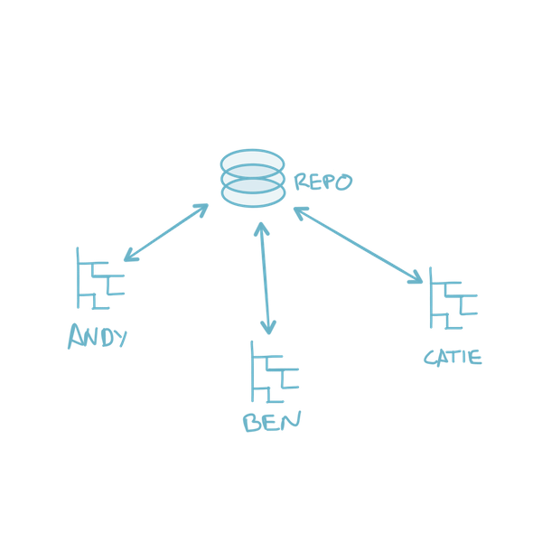
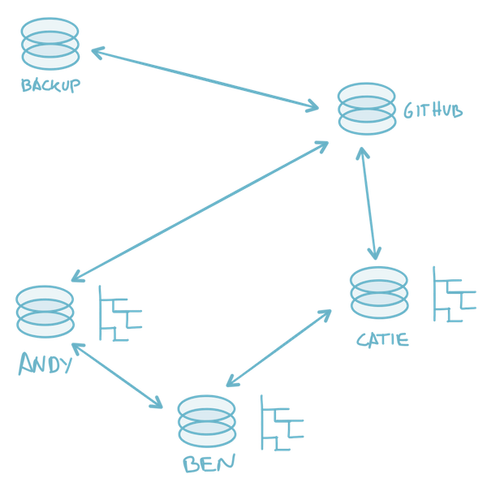

# 狼 wolf

## about

#### VCS

Centralized Version Control System



Distributed Version Control System



#### download && install

https://git-scm.com/

## help

```
git help
git help <command>
git help status
```

## setup

#### [git config](git-config.md)

## repo

```
mkdir wolf
cd wolf
git init
```

## workflow

```
echo "wolf" > readme.md
git status
git s
git add readme.md
git status
git s
git commit -m "initial"
```

#### quick workflow

```
echo "colors: black, brown, grey, ginger" >> readme.md
git s
git commit -am "adds wolf colors"
```

#### git add

```
git add <list of files>
git add --all
git add *.txt
git add docs/*.txt
git add docs/
git add "*.txt" # whole project
```

## history

#### git log

```
git log
git lg
```

#### GUIs

http://gitup.co/

## diff

```
echo "meow" >> readme.md
git diff
git add readme.md
git diff
git diff --staged
```

## undo

#### unstaging

```
git status
git reset HEAD <file>
git reset HEAD readme.md
git status
```

#### discard changes

```
git status
git checkout -- <file>
git checkout -- readme.md
git status
```

#### undo commit

```
echo "meow" >> readme.md
git commit -am "meow"
git lg
git reset --soft HEAD~1
git lg
git status
git commit -am "meow"
git lg
git reset --hard HEAD~1
git status
```

#### amend commit

```
git lg
git commit --amend -m "New Message"
git lg
```
```
git lg
echo "scientific name: canis lupus" >> readme.md
git add readme.md
git commit --amend -m "adds scientific name"
git lg
```

#### untrack

```
git rm --cached development.log
```

#### remove

```
git rm README.txt
```

## remotes

```
git remote add origin https://
git remote -v
```

#### push

```
git push -u origin master
```

#### pull

```
git pull
```

#### manage

```
git remote add <name> <address>
git remote rm <name>
```

---

[next level](tiger.md)
